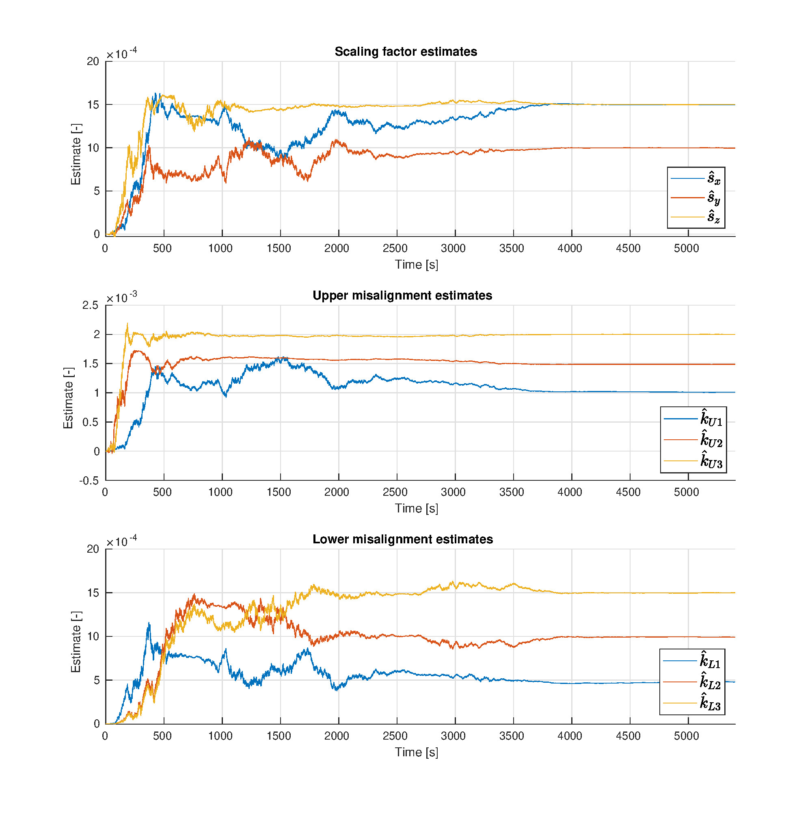
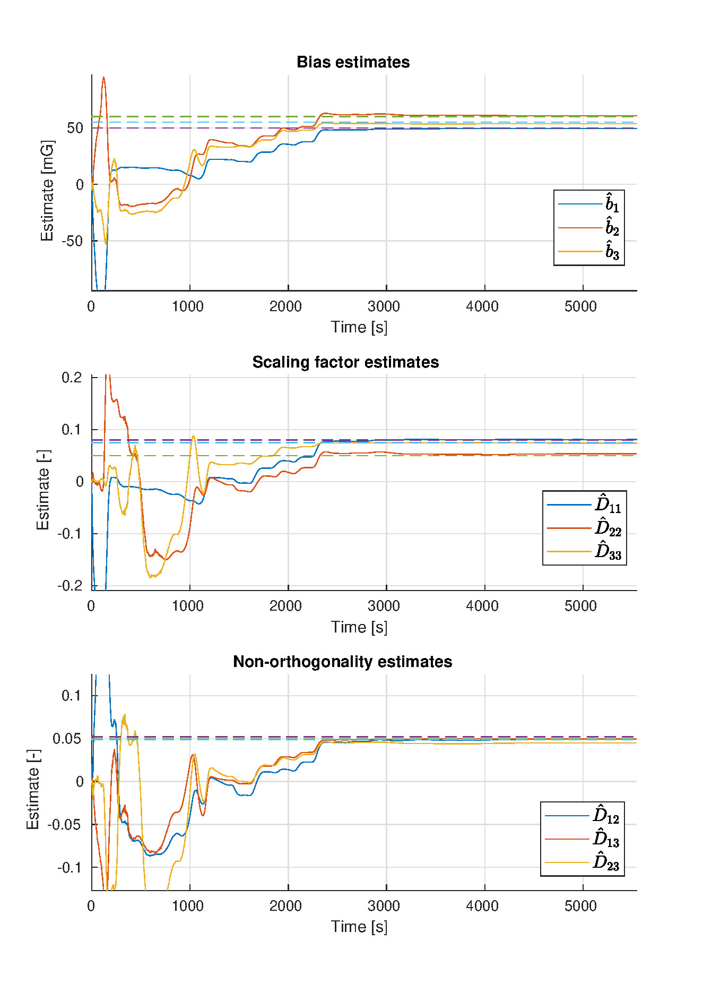
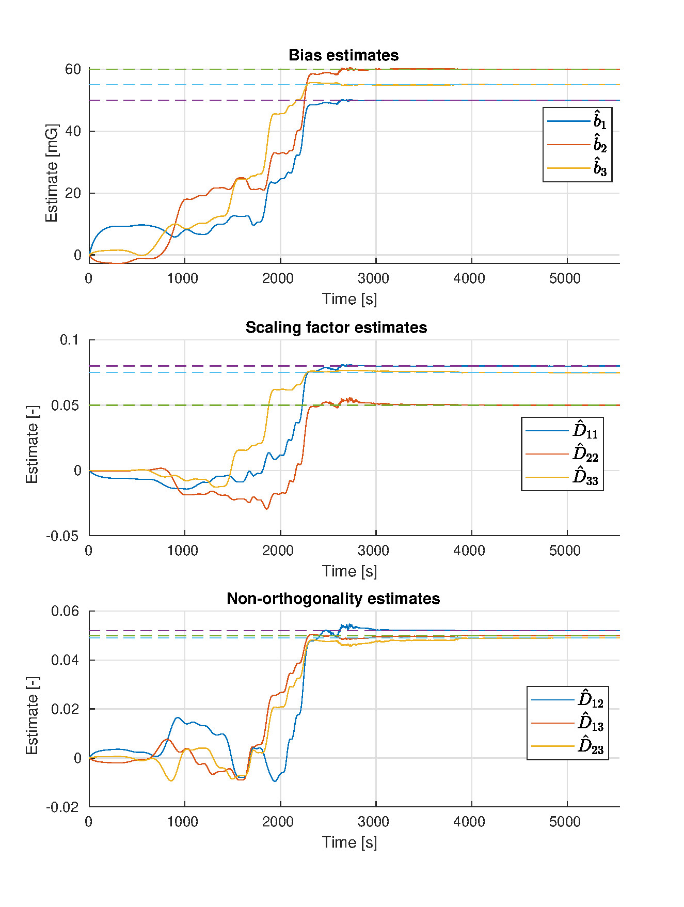
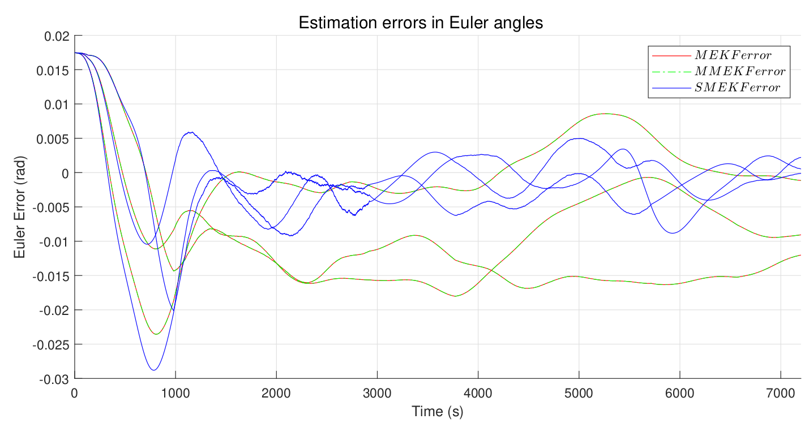
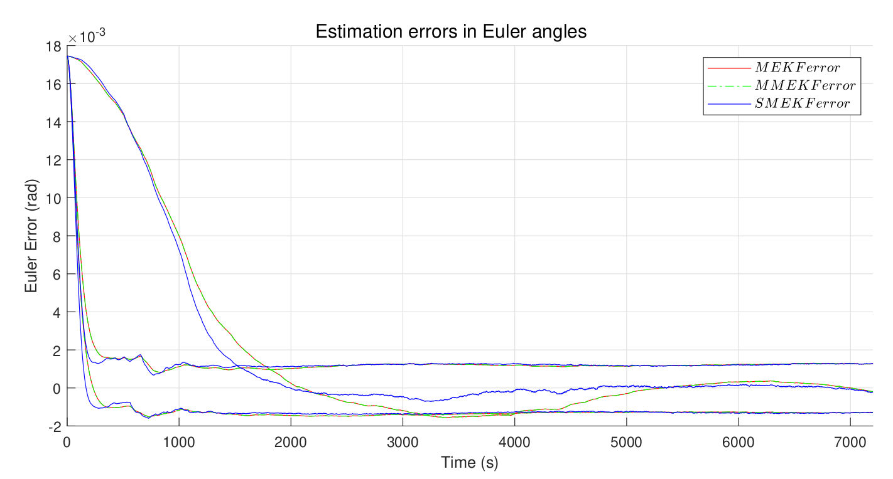

# High-precision attitude estimation for a satellite
A 9th semester project for the MSc. Control and Automation at Aalborg University regarding the attitude estimation for a satellite in LEO. The project simulates a satellite in a circular orbit at approximately 400km altitude. To simulate the geomagnetic field (required for subsequent simulations of magnetometer measurements) the International Geomagnetic Reference Field (IGRF-13) was used [1]. The satellite is assumed to be able to carry star trackers, gyroscopes, magnetometers, and fine sun sensors. For attitude estimation a total of 5 different scenarios using different combinations of sensors were tested and compared.

## Filters
Throughout the project a set of filters for both sensor calibration and attitude estimation was implemented. These include:
* A Multiplicative Extended Kalman Filter (MEKF) for attitude estimation [2]
* Murrell's formulation of the MEKF for attitude estimation [2]
* A Sequential MEKF for attitude estimation [3]
* An MEKF for in-orbit gyroscope calibration [2]
* An EKF for attitude-independent magnetometer calibration [4]
* A square-root formulation of the Unscented Kalman Filter (SR-UKF) for attitude-independent magnetometer calibration [5, 6]

## Results
### Calibration simulations
For in-depth explanations of the meaning of the calibrated parameters the reader may refer to [2, 4, 5]. The results are presented in plots below.

Gyroscope EKF calibration results:

Magnetometer EKF calibration results:

Magnetometer SR-UKF calibration results:

All calibrations are observed to converge close to the correct values. The SR-UKF for calibrating the magnetometer does however noticeably outperform the EKF in this case.
The average accuracy across all parameters is found to be: 

|              | Gyroscope calibration EKF | Magnetometer calibration EKF | Magnetometer calibration SR-UKF |
|--------------|---------------------------|------------------------------|---------------------------------|
| **Accuracy** | 99.06                     | 96.85%                       | 99.99%                          |

The accuracy refers to the difference between the estimated value and the true value used for simulating the sensor.

### Attitude-estimation simulations
A large amount of different simulations were run: 5 different scenarios, each multiple times with varying initial attitude estimate error.
The scenarios are:
1. A satellite with a star tracker, and a gyroscope
2. A satellite with fine sun sensors, magnetometers, and gyroscopes
3. A satellite with magnetometers, and gyroscope
4. A satellite with fine sun sensors, and gyroscope
5. A satellite with star tracker, fine sun sensor, magnetometer, and gyroscope

It was found that for satellites without star trackers, the SMEKF converges to smaller errors faster both when the initial attitude estimate is close to the actual attitude and when it is far. Simultaneously, it does not significantly increase the computation time when compared to Murrell's MEKF, and in no scenario does it perform worse. Murrell's MEKF and the regular MEKF generally have the same exact performance in terms of estimation accuracy, however Murrell's MEKF requires significantly less computation time, making it superior one of the two. It is noted however, that the SMEKF should be the preferred choice for this scenario due to its decreased convergence time.

Plot of the attitude estimate error for scenario 2, when the initial attitude error is 1 deg. about each the satellite's axes.

When star trackers are added to the satellite, the advantage of the SMEKF is diminished, and the three filters all have comparable performance, due to the accuracy of the star trackers.

Plot of the attitude estimate error for scenario 5, when the initial attitude error is 1 deg. about each the satellite's axes.

Overall, the SMEKF is found to outperform the others, especially in cases where only cheaper sensors such as magnetometers or fine sun sensors are used. Adding star trackers removes its advantage. In any case, Murrell's MEKF is preferred over the regular MEKF as the computation time is much lower, and the accuracy the same.

## References
[1] P. Alken, E. Thébault, C. D. Beggan, et al. _“International Geomagnetic Reference Field: the thirteenth generation”_. eng. In: Earth, planets, and space 73.1 (2021), pp. 49–25. issn: 1343-8832.

[2] F. Landis Markley and J. L Crassidis. _"Fundamentals of Spacecraft Attitude Determination and Control"_. eng. Vol. 33. Space Technology Library. New York, NY: Springer, 2014. isbn: 9781493908011.

[3] Sai Jiang Fangjun Qin Lubin Chang and Feng Zha. _"A Sequential Multiplicative Extended Kalman Filter for Attitude Estimation Using Vector Observations"_. https://www.ncbi.nlm.nih.gov/pmc/articles/PMC5982416/. 2018.

[4] Roberto Alonso and Malcolm D. Shuster. _“Complete Linear Attitude-Independent Magnetometer Calibration”_. eng. In: The Journal of the astronautical sciences 50.4 (2002), pp. 477–490. issn: 0021-9142.

[5] J. L. Crassidis, K. L. Lai, and R. R. Harman. _“Real-Time Attitude-Independent Three-Axis Magnetometer Calibration”_. In: Journal of Guidance Control and Dynamics 28 (2005), pp. 115–120.

[6] R. Van der Merwe and E.A Wan. _“The square-root unscented Kalman filter for state and parameter-estimation”_. eng. In: 2001 IEEE International Conference on Acoustics, Speech, and Signal Processing. Proceedings (Cat. No.01CH37221). Vol. 6. IEEE, 2001, 3461–3464 vol.6. isbn: 0780370414.

